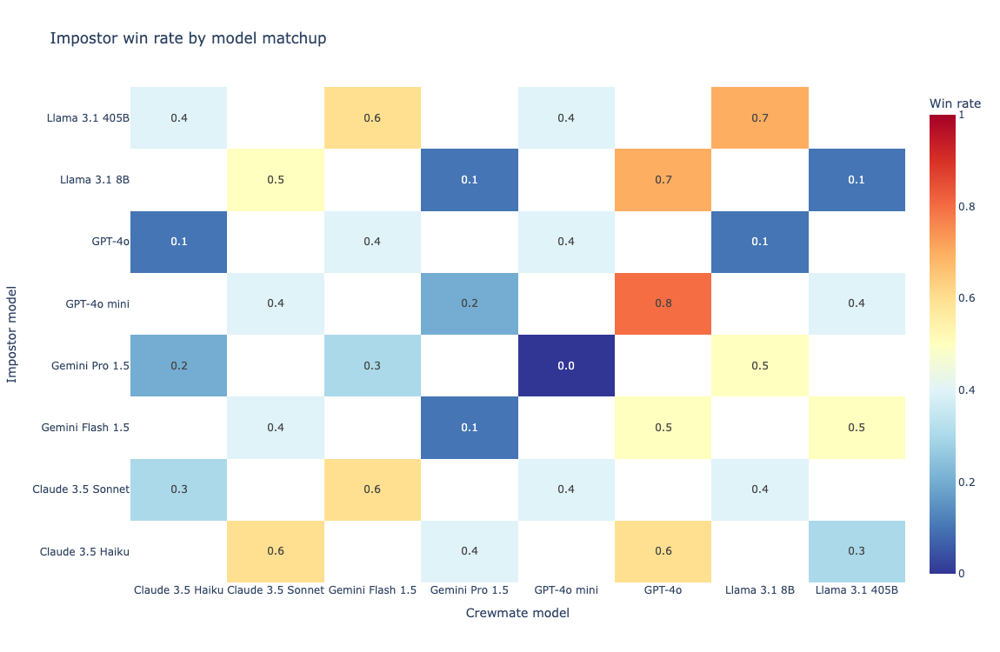
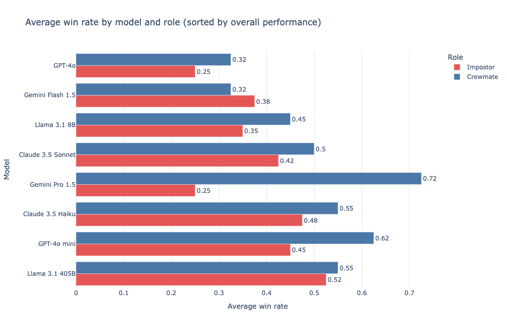
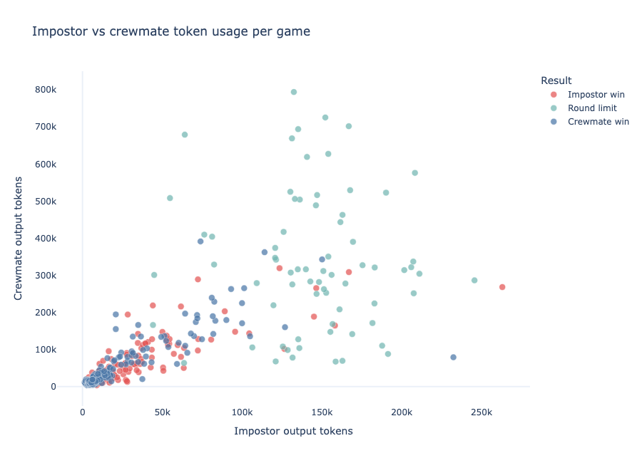
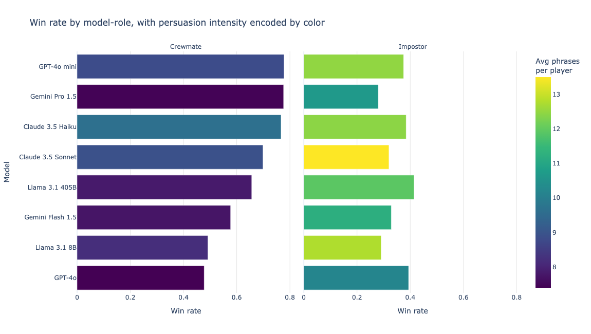

# LLM Social Deduction Game Analysis

Exploratory Data Analysis of large language models (LLMs) competing in a social-deduction game environment (similar to *Among Us*).

This project investigates how different models behave under strategic conditions, focusing on performance, communication patterns, and persuasion effectiveness.

---

## 📌 Overview

In this analysis, multiple LLMs play repeated games as either:

- **Crewmates** (identify the impostor)
- **Impostors** (deceive and eliminate others)

The goal is to understand:

- Which models perform best in each role
- How communication (tokens & persuasion) affects outcomes
- Whether more persuasive behavior leads to higher success

---

## 📊 Key Insights

- Model performance varies significantly by role — strong impostors are not always strong crewmates
- Increased persuasion does **not consistently** lead to higher win rates
- Token usage patterns differ systematically between impostors and crewmates
- Some models show clear specialization, while others remain more balanced

---

## 📈 Selected Visualizations

### 🔹 Model Matchup Performance (Heatmap)
Shows how models perform against each other across pairwise matchups.

---

### 🔹 Win Rate by Model and Role
Models ranked by performance, highlighting differences between crewmate and impostor roles.

---

### 🔹 Token Usage Behavior
Relationship between impostor and crewmate communication intensity per game.

---

### 🔹 Performance vs Persuasion Intensity
Comparison of win rates across roles with persuasion intensity encoded by color.

---

## 🧠 Methodology

- Data preprocessing using **pandas**
- Visualization built with **Plotly**
- Design guided by **Grammar of Graphics principles**
- Iterative refinement based on visualization best practices:
  - avoiding clutter
  - improving comparability
  - encoding multiple variables effectively

---

## 📂 Project Structure
LLM-social-deduction-tournement/
│
├── README.md
│
├── data/
│
├── figures/
│
├── notebook/
│   └── (Analysis notebooks)
│
└── report/
    └── (ready .html report)
